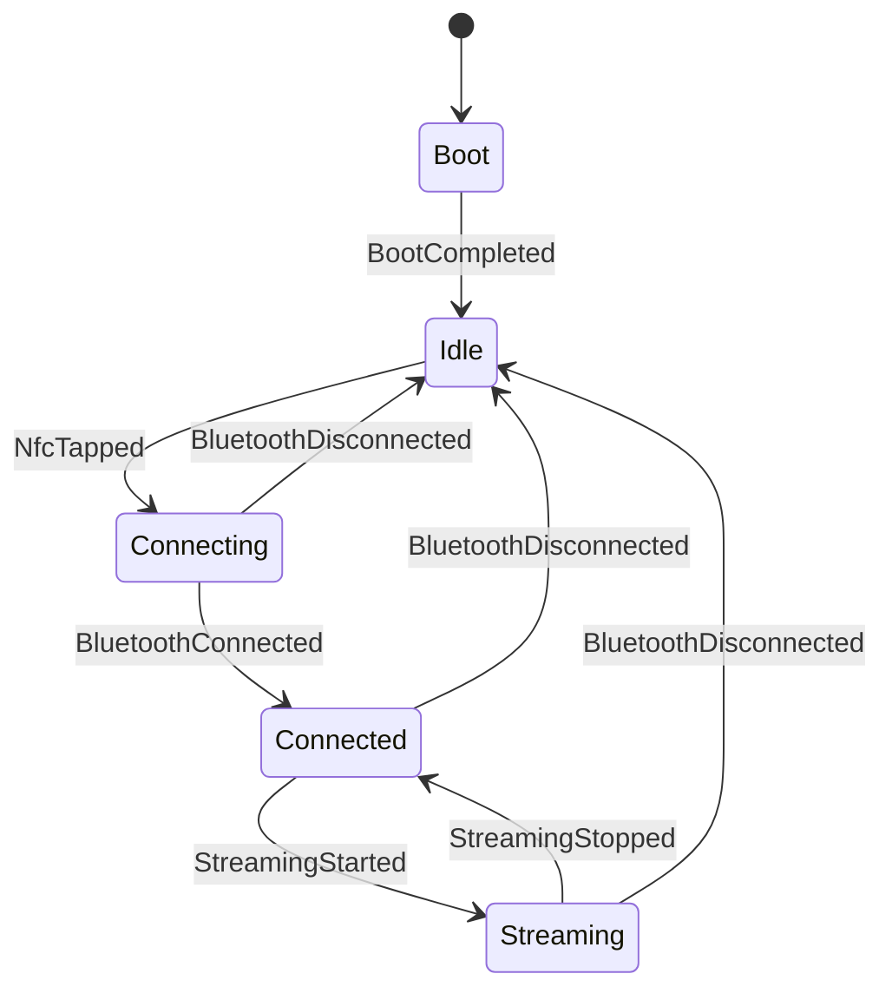

# TapTune Firmware Architecture

## Overview

The firmware is organized into independent **components**, each encapsulated in its own directory under `components/`. Every component exposes a well‑defined interface (`include/*.hpp`) and communicates with others through a **finite state machine** and event queues.

---

## State Diagram

---

## Components

| Component           | Responsibility                                                              |
|---------------------|-----------------------------------------------------------------------------|
| `state_machine`     | Manages states and transitions; notifies listeners via callback.            |
| `led_indicator`     | Controls the RGB LED based on the current state.                            |
| `tone_player`       | Generates non‑blocking PWM tones for pairing and streaming events.          |
| `display_manager`   | Manages the OLED display via LVGL, updating text according to the state.    |
| `bt_manager`        | Implements the Bluetooth A2DP sink and raises events (connected, streaming, …). |
| `nfc_manager`       | Detects when an NFC reader reads the tag, generating the NfcTapped event.   |
| `taptune_config`    | Global constants (pin assignments, device name, …).                         |

---

## Execution Flow

1. `app_main()` instantiates all components and the state machine.
2. The state machine receives a callback that, on every state change, calls `applyState()` on the LED and display, and `onStateChanged()` on the tone player.
3. The main loop runs every 20 ms:
   - `tone.tick()` (handles PWM buzzer patterns)
   - `display.tick()` (calls `lv_timer_handler()` for LVGL)
   - Reads event queues from `bt_manager` and `nfc_manager` and forwards them to the state machine.
4. After boot, `BootCompleted` transitions to `Idle`. Bluetooth is started (`bt.start()`) to become discoverable.
5. When a phone taps the NFC area, the PN532 emits `NfcTapped`, transitioning to `Connecting`.
6. Upon Bluetooth connection, `bt_manager` produces `BluetoothConnected` and the state becomes `Connected`.
7. When audio streaming begins, `bt_manager` emits `StreamingStarted` and the state moves to `Streaming`.
8. Similarly for disconnection or stream stop.

---

## Code Conventions

- **Namespace**: `taptune::`
- **Constants**: `kPrefix` (e.g., `kDeviceName`)
- **Private members**: trailing underscore (`name_`)
- **Includes**: own header first, then ESP‑IDF drivers, then `esp_log.h`
- **CMake**: explicit `REQUIRES`, no GLOB, each component has `INCLUDE_DIRS include` and `SRCS src/*.cpp`
- **Logging**: `ESP_LOGI/ESP_LOGE` with `constexpr` tag

---

## Architectural Decisions (ADR)

- [ADR-001: Framework choice (ESP‑IDF vs Arduino)](docs/architecture/decisions/ADR-001-framework-choice.md)
- [ADR-002: NFC NDEF approach via PN532](docs/architecture/decisions/ADR-002-nfc-ndef-approach.md)
- [ADR-003: Graphics library LVGL vs Adafruit SSD1306](docs/architecture/decisions/ADR-003-lvgl-vs-adafruit.md)

---

For implementation details, see the code comments and Doxygen documentation (generated with `doxygen Doxyfile`).
