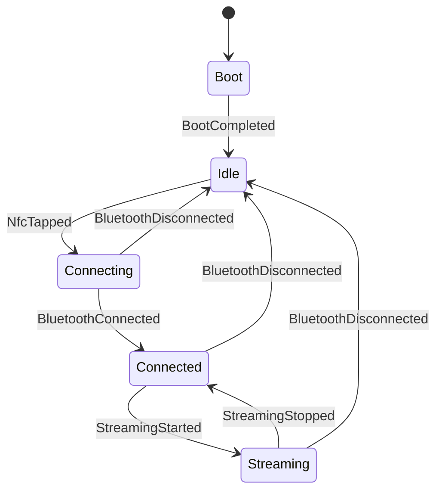

# TapTune State Machine

## States

- **Boot**: hardware initialization; immediately after `BootCompleted` it transitions to `Idle`.
- **Idle**: waiting for an NFC tap.
- **Connecting**: the PN532 has detected a reader, the device is discoverable and waiting for Bluetooth connection.
- **Connected**: connected but no active audio streaming.
- **Streaming**: audio playback in progress.
